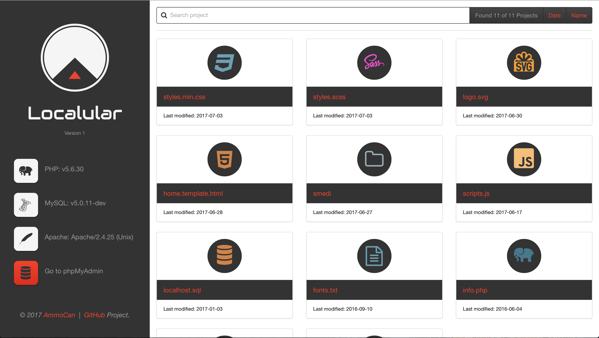

# Localular
A modern theme for your Apache localhost directory.

## Description
Localular is a modern theme built with AngularJS, PHP, HTML5, CSS3, and jQuery to enhance the experience of browsing your Apache localhost web directory on a Mac.

### Requirements:
* macOS Sierra
* User level root web directory (i.e. Sites folder)
* PHP >= v5.6.30
* Apache >= v2.4.25
* A sense of humor

## Installation
1. Download the repository.
2. If needed rename the name of the folder to `localular`.
3. Move the `index.php` and `htaccess.txt` files from inside the `localular` folder to your user level root web directory, which is the `Sites` folder.
4. Rename the `htaccess.txt` file to `.htaccess`.
5. Now, move the `localular` folder to your `Sites folder`.
6. Restart Apache in your terminal:
```
sudo apachectl restart
```

**Additionally, for all sub-directories to use the Localular theme, you need to copy and paste both the `index.php` file and the `localular` folder in the root of each sub-directory.**

##Features
> Responsive modern aesthetics

> Icons by file type

> Search directory

> Directory count

> Sort by date or name

> List PHP, MySQL, and Apache version

> Link to phpMyAdmin

> Best of all it’s free!

## Screenshots
1. Here's what the Localular theme looks like.


## Troubleshooting

In my `vhosts` file, which is located at: `/etc/apache2/extra/httpd-vhosts.conf`, I have the following config setting for my user level root web directory (`username` will obviously need to be your username on the machine) :
```
<Directory "/Users/username/Sites">
    DirectoryIndex index.php index.cfm index.html index.htm
    Options Indexes FollowSymLinks MultiViews
    AllowOverride All
    Require all granted

    #Custom directory listing
    IndexOptions +SuppressHTMLPreamble
    AddType text/html .php
    Addhandler application/x-httpd-php .php
</Directory>
```

## To Do List
* Add a return to parent directory link if using theme in sub-directory
* Expand on the icon feature set and active state
* Develop a seed/boilerplate for more efficient future customization

## Resources
* [AngularJS v1.6.4](https://angularjs.org/)
* [Angular Base Apps v2.0.10](http://base-apps.github.io/angular-base-apps/latest/#!/)
* [jQuery v3.2.1](https://jquery.com)
* [PHP v5.6.30](http://php.net)

## Inspiration
Localular was inspired by:
[Victor Camargo’s](https://github.com/VictorCamargo)
work on [LocalTheme](https://github.com/VictorCamargo/LocalTheme).

## Changelog

#### 1.0
* Start version.
